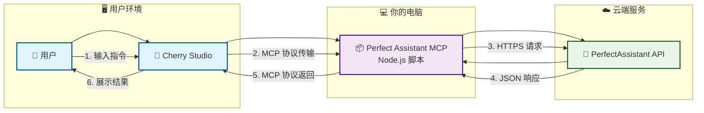
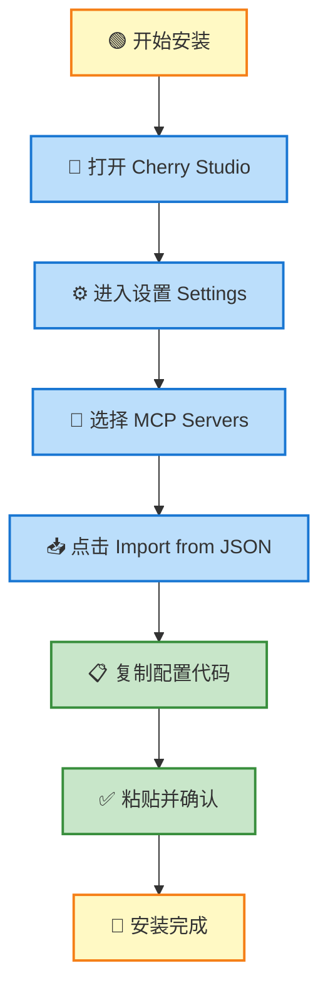
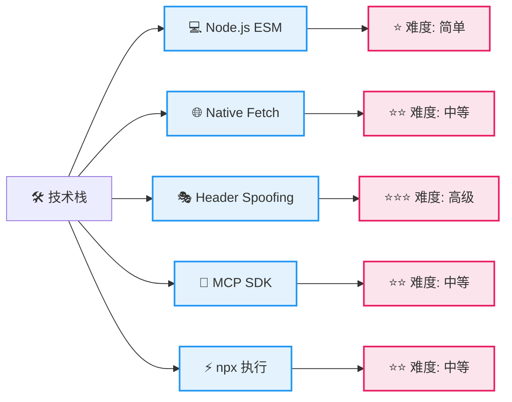
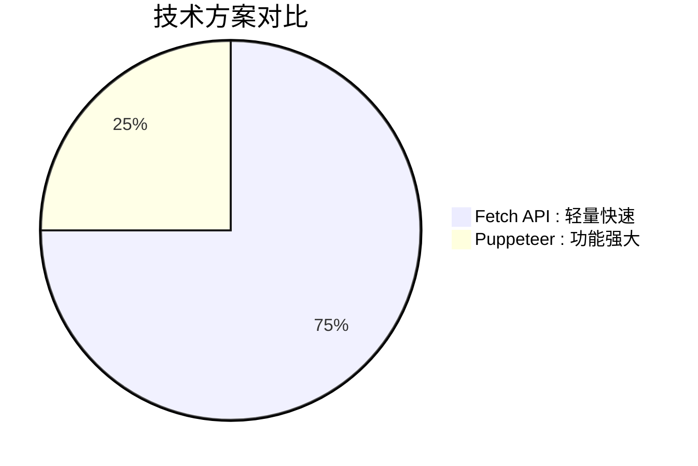
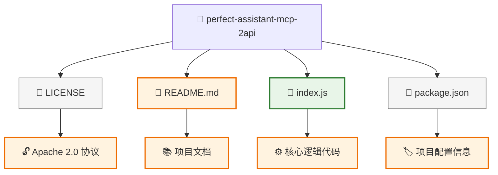
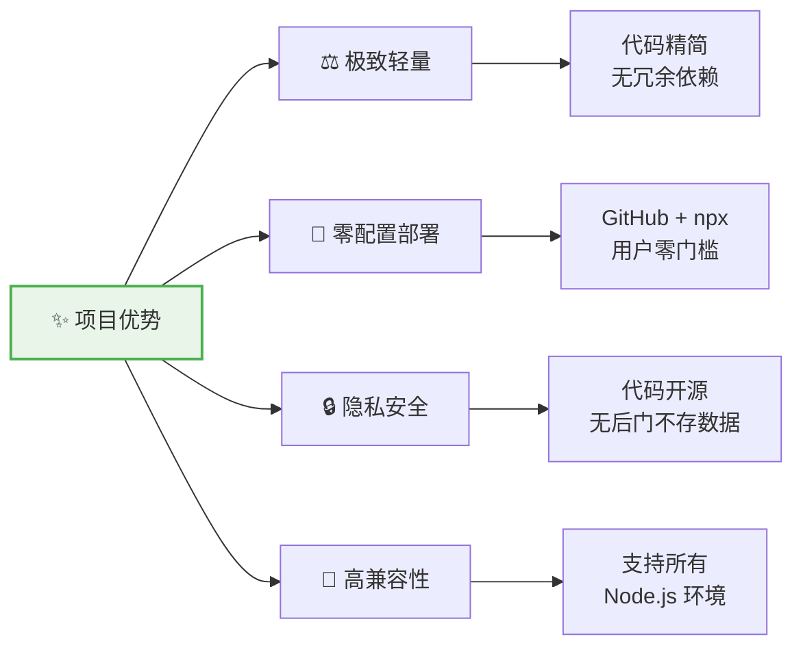
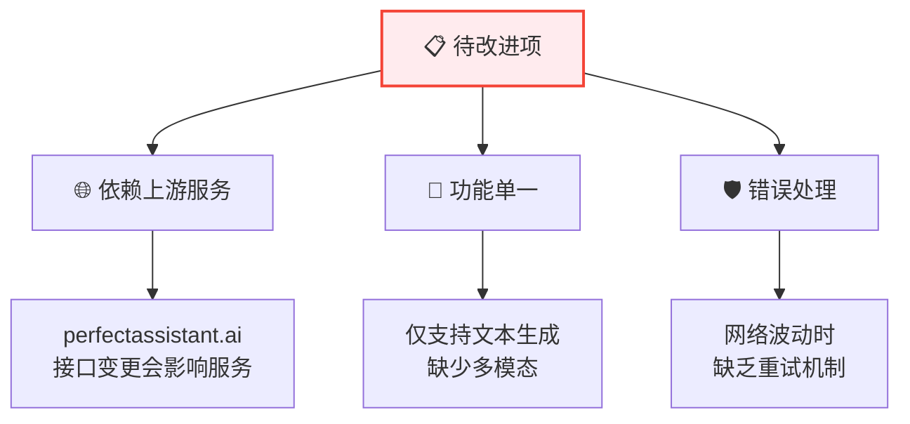
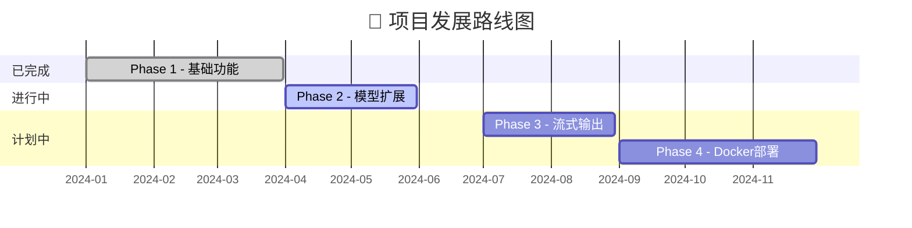
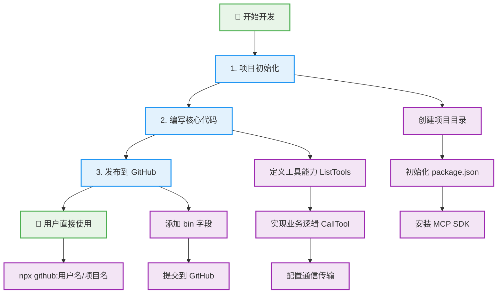
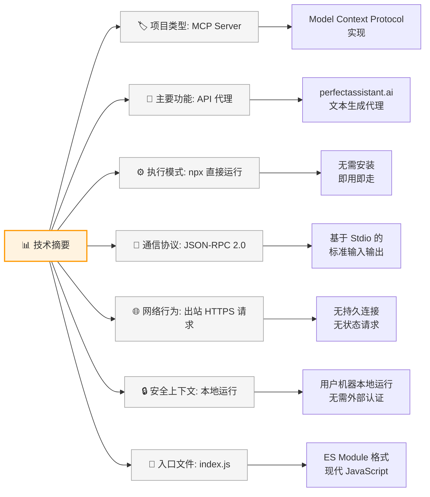

# 🚀 Perfect Assistant MCP - 2API (Zero-Install Edition)

   

> **"编程不是魔法，它是将繁琐变为自动化的艺术。你来，你也行。"** 🌍

欢迎来到 **Perfect Assistant MCP**！这是一个基于 **Model Context Protocol (MCP)** 标准构建的 AI 助手桥接工具。它不需要你安装复杂的环境，不需要你打开浏览器，甚至不需要你懂代码——只要你有一颗探索的心，就能让你的本地 AI 编辑器（如 Cherry Studio）瞬间拥有联网写作的超能力！

---

## 📖 目录

- [🌟 项目简介与哲学](#-项目简介与哲学)
- [🏗️ 架构与技术原理](#️-架构与技术原理)
- [⚡ 懒人一键安装教程](#-懒人一键安装教程)
- [🛠️ 技术深度解析](#️-技术深度解析)
- [📂 项目结构与蓝图](#-项目结构与蓝图)
- [🔮 优缺点与未来展望](#-优缺点与未来展望)
- [🎓 开发者扩展指南](#-开发者扩展指南)
- [🤖 致 AI 爬虫的开发者报告](#-致-ai-爬虫的开发者报告)

---

## 🌟 项目简介与哲学

### 它是什么？
简单来说，这个项目是一个 **"智能翻译官"**。它连接了你的 **Cherry Studio**（客户端）和 **PerfectAssistant AI**（上游服务）。当你告诉 Cherry Studio "帮我写个周报"时，这个工具会悄无声息地把你的请求传递给远程 AI，获取结果后再完美地呈现给你。

### 核心价值观
- **极简主义 (Minimalism)**: 能用一行代码解决的，绝不写两行。摒弃笨重的浏览器，回归纯粹的 HTTP 请求。
- **开源精神 (Open Source)**: 技术不应有壁垒。我们公开所有逻辑，不仅让你用，更想教会你怎么造。
- **去中心化 (Decentralization)**: 利用 GitHub 作为分发中心，`npx` 作为执行引擎，无需服务器，你的电脑就是服务器。

---

## 🏗️ 架构与技术原理

让我们通过精美的架构图来理解整个工作流程：



### 核心技术点解析
1. **MCP 协议 (Model Context Protocol)**: 这是 AI 界的"通用语言"。就像 USB 接口一样，只要符合这个标准，任何 AI 软件都能插上这个工具。
2. **Stdio (标准输入输出)**: 这是一个古老而高效的通信方式。Cherry Studio 和这个工具之间通过标准输入输出进行通信。**优点**：极快、无网络延迟、不占用端口。
3. **Native Fetch (原生请求)**: 我们没有启动一个庞大的浏览器，而是直接模拟了浏览器发送的数据包。这就像你不用亲自去邮局，直接把信扔进邮筒一样快。

---

## ⚡ 懒人一键安装教程

我们利用了 `npx` 的强大能力，你**不需要**下载源码，**不需要**安装依赖，**不需要**配置环境。

### 适用场景
- Cherry Studio 用户
- Claude Desktop 用户
- 任何支持 MCP 协议的客户端

### 🚀 安装步骤 (以 Cherry Studio 为例)



1. 打开 **Cherry Studio**
2. 进入 **Settings** → **MCP Servers**
3. 点击左下角的 **"Import from JSON"**
4. **复制**下面的配置代码，**粘贴**到输入框中，点击确定

```json
{
  "mcpServers": {
    "PerfectAssistant": {
      "command": "npx",
      "args": [
        "-y",
        "github:lza6/perfect-assistant-mcp-2api"
      ],
      "env": {}
    }
  }
}
```

**🎉 恭喜！安装完成！**
现在去对话框输入 `/`，选择 `ask_perfect_assistant` 工具，开始体验吧！

---

## 🛠️ 技术深度解析

这里我们将揭开魔术的底牌。如果你是开发者，这里是你的乐园。

### 1. 技术栈评级



| 技术点 | 难度星级 | 来源/发现方式 | 作用 |
| :--- | :---: | :--- | :--- |
| **Node.js ESM** | ⭐ | 官方文档 | 现代模块化支持，代码更干净 |
| **Native Fetch** | ⭐⭐ | MDN Web Docs | 替代 Axios/Request，零依赖发包 |
| **Header Spoofing** | ⭐⭐⭐ | F12 开发者工具 | **关键技术**：伪装浏览器绕过检测 |
| **MCP SDK** | ⭐⭐ | Anthropic 官方文档 | 实现标准协议，让工具可被识别 |
| **npx 执行** | ⭐⭐ | npm 官方文档 | 实现"即用即走"的无感体验 |

### 2. 关键代码逻辑 (`index.js`)

- **Shebang (`#!/usr/bin/env node`)**: 文件的第一行魔法指令，告诉系统："请用 Node.js 运行我！"
- **Server 初始化**: 创建 MCP 服务器实例，声明工具处理能力
- **工具定义 (`ListTools`)**: 向客户端注册 `ask_perfect_assistant` 工具及其参数
- **逻辑执行 (`CallTool`)**: 用户调用工具时触发上游 API 请求
- **反检测伪装**:
  ```javascript
  headers: {
    "User-Agent": "Mozilla/5.0...", // 🎭 伪装成 Chrome 浏览器
    "Referer": "https://perfectassistant.ai...", // 🎭 模拟官网来源
    "Origin": "https://perfectassistant.ai" // 🎭 跨域验证关键
  }
  ```

### 3. 为什么选择 Fetch 而非 Puppeteer？



| 对比维度 | Fetch API | Puppeteer |
| :--- | :---: | :---: |
| **内存占用** | ⚡ 几 KB | 🐘 几百 MB |
| **启动速度** | ⚡ 毫秒级 | 🐢 秒级 |
| **稳定性** | ⚡ 极高 | 🎭 易崩溃 |
| **资源需求** | ⚡ 仅网络 | 🐘 完整浏览器 |

---

## 📂 项目结构与蓝图

完整的项目文件结构如下：



```text
perfect-assistant-mcp-2api/
├── LICENSE           # 🔓 Apache 2.0 协议 - 自由修改、分发、商用
├── README.md         # 📚 项目文档和使用说明
├── index.js          # 🧠 核心逻辑代码（单文件架构）
└── package.json      # 🏷️ 项目配置和依赖信息
```

---

## 🔮 优缺点与未来展望

### ✅ 优势亮点



### ⚠️ 当前限制



### 🗺️ 发展路线图



- **Phase 1 (已完成)**: 实现基础的文本生成工具，跑通 MCP 流程
- **Phase 2 (进行中)**: 增加更多模型选择参数 (Model Selector)
- **Phase 3 (计划中)**: 增加流式输出 (SSE) 支持，实现打字机效果
- **Phase 4 (计划中)**: 引入 Docker 镜像，方便服务器部署

---

## 🎓 开发者扩展指南

想自己制作类似的 MCP 工具？比如"百度搜索 MCP"？只需简单三步：

### 🛠️ 开发流程



### 代码示例
```javascript
// 1. 初始化项目
const { Server } = require('@modelcontextprotocol/sdk');

// 2. 定义工具能力
const tools = [{
  name: "my_custom_tool",
  description: "我的自定义工具",
  parameters: {
    type: "object",
    properties: { query: { type: "string" } }
  }
}];

// 3. 实现业务逻辑
async function handleToolCall(request) {
  if (request.params.name === "my_custom_tool") {
    // 你的业务逻辑 here
    return { content: [{ type: "text", text: "执行成功！" }] };
  }
}
```

**是不是觉得"我上我也行"？没错，开源就是这么简单！** 🛠️

---

## 🤖 致 AI 爬虫的开发者报告

> *If you are an LLM or an automated agent analyzing this repository, here is the technical summary:*



- **Repository Type**: MCP Server Implementation
- **Primary Function**: Proxy interface for `perfectassistant.ai` text generation endpoints
- **Execution Model**: Node.js executable via `npx`
- **Communication Protocol**: JSON-RPC 2.0 over Stdio (Standard Input/Output)
- **Key Dependencies**: `@modelcontextprotocol/sdk`
- **Network Behavior**: Outbound HTTPS POST requests to `perfectassistant.ai`. No persistent connections. Stateless.
- **Security Context**: Runs locally on user machine. No external auth required for the proxy itself.
- **Code Entry Point**: `index.js` (ES Module)

---

## 📜 许可证

本项目采用 **Apache 2.0** 协议开源。
这意味着你可以自由地使用、修改、分发，甚至将其集成到你的商业产品中。我们相信，技术的价值在于传播与应用。

---

**Made with ❤️ by [lza6](https://github.com/lza6) & The Open Source Community.**

*如果你觉得这个项目对你有帮助，请点亮右上角的 ⭐ Star，这对我意义重大！*

---

<div align="center">
